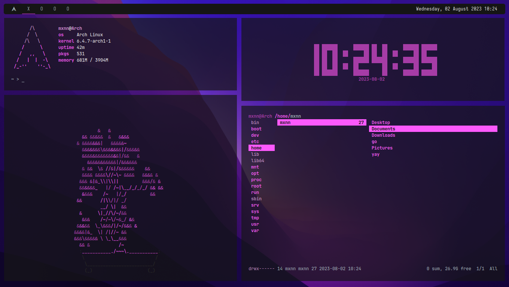

---

---

<!-- 

 
-->

## What I use
- [polybar](https://github.com/polybar/polybar/) (System Bar)
- [rofi](https://github.com/davatorium/rofi) (Program Launcher)
- [alacritty](https://github.com/alacritty/alacritty) (Terminal)
- xfce (Desktop Environment)
- thunar (File Manager)
- lollypop (Music Player)
- firefox (Web Browsing)
- pulseaudio (Audio)
- zsh (User Shell)
- [htop](https://github.com/htop-dev/htop) (System Monitoring)
- [neovim](https://github.com/neovim/neovim) (Text Editor)
- [white-sur](https://www.gnome-look.org/p/1403328/) (gtk theme)
- [white-sur-icon](https://www.pling.com/p/1405756/) (icon theme)
- [mcmojave-cursors](https://www.gnome-look.org/p/1355701) (cursor theme)

## What I Don't Use
- login / display manager (only startx)
   
----

*Made possible with the help of [caledumb's](https://github.com/calesdumb/dotfiles) dotfiles.*
