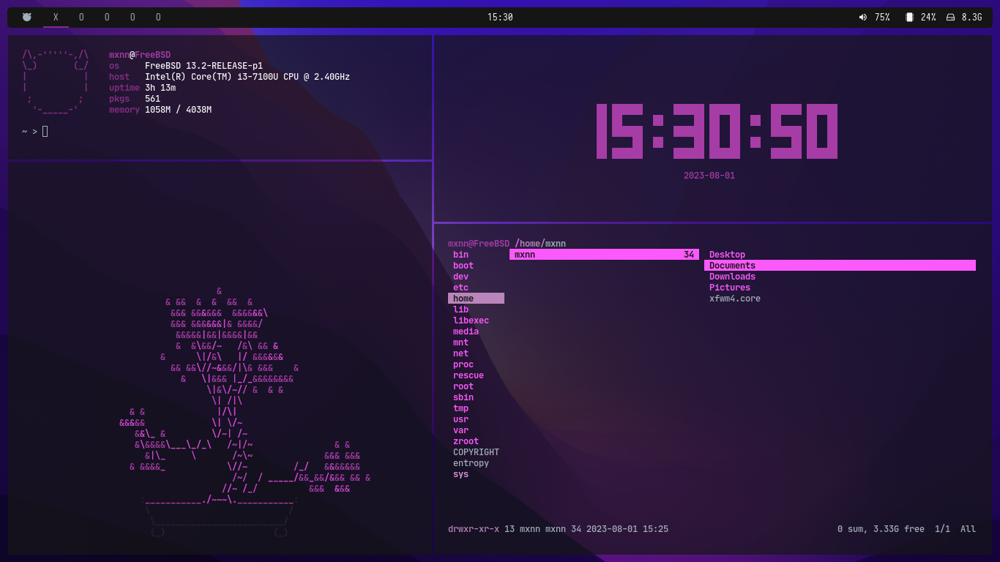
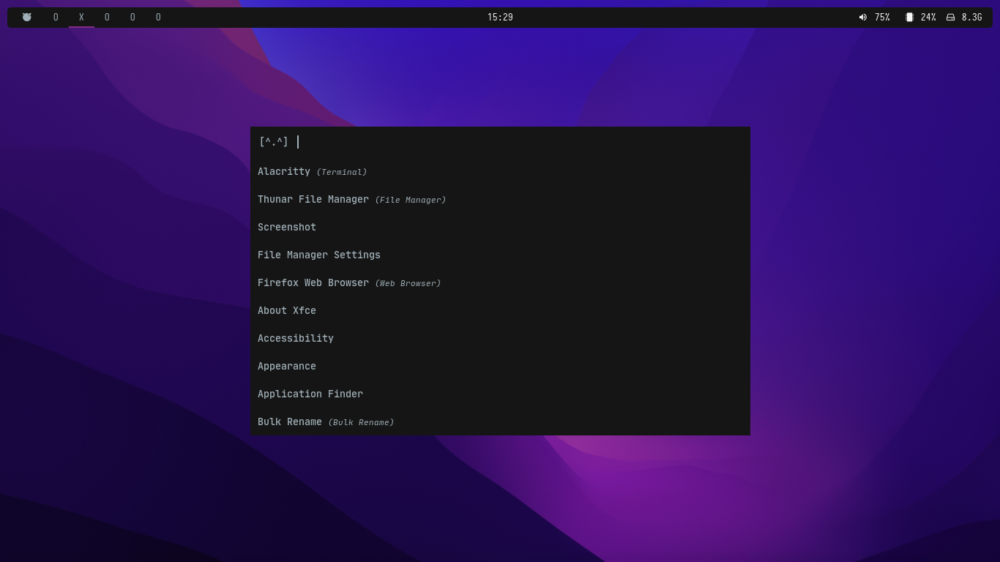

<!--

 
-->

- Panel: [Polybar](https://github.com/polybar/polybar)
- Launcher: [Rofi](https://github.com/davatorium/rofi)
- Notify Daemon: [Dunst](https://github.com/dunst-project/dunst)
- File Manager: [Thunar](https://gitlab.xfce.org/xfce/thunar)
- Terminal: [Alacritty](https://github.com/alacritty/alacritty)
- Font: [JetBrainsMono Nerd Font](https://www.nerdfonts.com/) 
- Visualizer: [Cava](https://github.com/karlstav/cava)


<br>
<details>
<summary><b>Install dependencies & packages</b></summary>
<br>

> Some dependencies / packages (not all)

```sh
alacritty zsh nerd-fonts noto polybar ranger rofi dunst \
htop gdu firefox pulseaudio \
pfetch cava cowsay starfetch cbonsai tty-clock \
```

</details>
<br>


## Screenshots
<!-- 
 -->


> <picture>
>   <source media="(prefers-color-scheme: light)" srcset="https://raw.githubusercontent.com/Mqxx/GitHub-Markdown/main/blockquotes/badge/light-theme/note.svg">
>   
> </picture><br>
>
> You will have to tweak the files to achieve the same look. 
<br>

## Special Thanks
- [calesdumb](https://github.com/calesdumb/dotfiles) *dotfiles*
- [sinomor](https://github.com/Sinomor/dots) *readme.md*


<h1> <!--
  <a href="#--------">
    
  </a> -->
  <a href="#--------">
    
  </a>
</h1>
